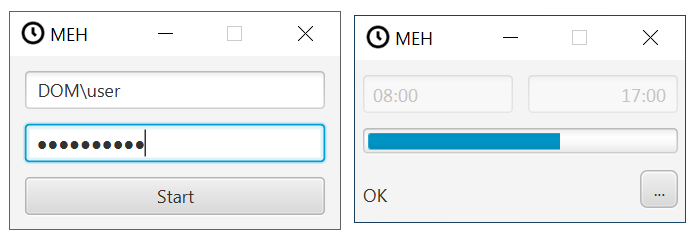

# My Eight Hours

My Eight Hours (MEH) es una aplicación que ayuda a controlar el tiempo trabajado. De forma automática, MEH consulta, almacena y procesa los fichajes para mostrar:

* Hora de entrada y de salida
* Tiempo a trabajar por día y semana.
* Desfase de horas trabajadas por día y semana.

## Uso

Solo hay que introducir las credenciales del Portal-del-empleado en el formulario de login de MEH, que se abre al iniciar.
Las credenciales son los mismos que se usan mediante el acceso con un navegador web.

## Configuración

Es posible configurar la aplicación por medio del fichero meh.properties que se encuentra en el directorio raíz de instalación de MEH.

| Clave          |         Defecto         |                                                                                                                              Descripción |
|----------------|:-----------------------:|-----------------------------------------------------------------------------------------------------------------------------------------:|
| user           | TELTRONICDOM\\\\usuario |                     Nombre de usuario idéntico al usado en el Portal-del-empleado. La contra-barra debe escaparse con otra contra-barra. |
| minimizetotray |          false          | Al minimizar la ventana de progreso, se oculta la ventana y se muestra un icono en la bandeja del sistema. Valores posibles: true, false |
| log            |          info           |                                          Define el nivel de log que se escribe. Valores posibles: trace, debug, info, warn, error, fatal |

## Duración de jornada
Las duraciones de las jornadas en MEH se miden en base al tiempo fichado, que no es el mismo que el trabajado. En este cómputo no se tiene en cuenta el fichaje de la cantina, ya que este solo se emplea para indicar que hacemos uso del servicio de comedor. La duración de jornada se compone de: trabajo (8h o 8h15min), almuerzo (15min) y comida (45min). Los tipos de jornada y su duración son:

| Tipo        | Duración |                   Desglose |
|-------------|:--------:|---------------------------:|
| Estándar    |  9h00m   |         8h + 15min + 45min |
| Reducida    |  6h15m   |                 6h + 15min |
| A recuperar |  9h15m   | 8h + 15min + 45min + 15min |
| Festiva     |   0h0m   |                       0min |

## Privacidad

Para el funcionamiento de la aplicación, MEH necesita recopilar datos privados del usuario. Estos datos se almacenan únicamente en una base de datos en el directorio temporal de usuario `<user.home>/.meh/mehdb`. La base de datos está cifrada.

En ningún momento se envían los datos recopilados, sino que permanecen localmente.

* **Información que es recogida:** Fecha, dirección, estado, tipo, y terminal de fichaje.

* **Uso de la información recogida:** Almacenamiento y procesado local.

* **Cookies:** N/A

* **Enlaces a Terceros:** N/A

* **Control de su información personal:** N/A

## Logs

Por defecto, MEH escribe una traza de log INFO al directorio `<user.home>/.meh/logs`. Es posible configurar el nivel de log configurando el fichero properties.

## FAQ

### ¿Cómo se obtiene el tiempo trabajado de un día?
El tiempo trabajado durante un día natural se calcula sumando los intervalos de tiempo entre cada fichaje de entrada y su fichaje de salida, con fichajes de entrada realizados entre las 00:00 y 23:59.

### ¿Por qué las jornadas no son de 8 horas exactas?
Porque en la duración de la jornada se incluyen los descansos para el almuerzo y la comida.

Una jornada estándar que empieza a las 08:00 termina a las 17:00, con 45 minutos para comer y 15 minutos para el almuerzo. Durante el almuerzo no se producen fichajes de entrada o salida, y el fichaje de la comida no se considera entrada o salida, por lo que esos intervalos aparecen. Por eso la suma de fichajes en un día estándar no es de 8 horas, sino de 9.
En el caso de las jornadas a recuperar, el tiempo de trabajo se incrementa en 15 minutos que sumados a 9h hacen 9 horas y 15 minutos.

### ¿Cómo obtiene MEH los datos de fichajes?
Tomando el usuario y contraseña del Portal-del-empleado, MEH navega de forma invisible y obtiene la información de fichajes.

## Ayuda a desarrollar este software

Se recomienda tener instalado la Java Dev Kit (JDK) 1.8. Como IDE se recomienda IntelliJ IDEA.
El proyecto se puede cargar facilmente con IntelliJ eligiendo "abrir proyecto" y seleccionando el settings.gradle del directorio raiz.

## Compilar y distribuir

El ejecutable `cleanDistribution.bat` generará un ZIP con la distribución en `./meh-javafx/build/distZip/`